# Schema Prisma — Smash

> Schema completo de la BD para el sistema POS multi-sucursal Smash.
> Convenciones, decisiones y diagrama ER. Para definiciones canónicas mirá [schema.prisma](./schema.prisma).

---

## Convenciones

| Tema         | Decisión                                                                                               |
| ------------ | ------------------------------------------------------------------------------------------------------ |
| Modelos      | PascalCase español (`Empresa`, `Sucursal`, `ProductoVenta`)                                            |
| Tablas       | snake_case español vía `@@map` (`producto_venta`, `item_pedido`)                                       |
| Columnas     | snake_case vía `@map` (`razon_social`, `precio_unitario`)                                              |
| IDs          | `cuid()` por default. Aproximadamente ordenable por tiempo de creación.                                |
| Money        | `BigInt` en guaraníes — entero, sin decimales. La serialización JSON se maneja en el bootstrap.        |
| Stock        | `Decimal(15, 3)` — tres decimales para gramos/mililitros.                                              |
| Coords       | `Decimal(10, 7)` para lat/lon.                                                                         |
| Tasas IVA    | `Decimal(5, 2)` cuando aplica, pero usamos enum `TasaIva` (IVA_10/IVA_5/IVA_0/EXENTO) por simplicidad. |
| Soft delete  | Campo `deletedAt DateTime?` + índice. Aplica en entidades históricas/fiscales.                         |
| Auditoría    | Combinada: `createdAt`/`updatedAt` global + tabla `AuditLog` para acciones críticas.                   |
| Multi-tenant | Filtrado por `empresaId` en entidades top-level + cascada implícita por relaciones.                    |
| Timestamp DB | `created_at`/`updated_at` en cada tabla relevante. TZ = `America/Asuncion` a nivel datasource.         |

---

## Estrategia multi-tenant

**Filtrado por relación, no redundancia masiva.** El middleware Prisma filtra cada query inyectando un `where` según el contexto del usuario (`empresa_id` y/o `sucursal_id` activa).

Las entidades caen en 3 grupos:

1. **Multi-empresa, multi-sucursal** (filtran por `sucursalId` ∈ sucursales del usuario): `Pedido`, `Comprobante`, `Caja`, `MovimientoStock`, `Compra`, `TransferenciaStock`, `StockSucursal`, `ZonaMesa`, `Mesa`, `PuntoExpedicion`, `Timbrado`.
2. **Multi-empresa, scope empresa** (filtran por `empresaId` ∈ empresa del usuario): `Sucursal`, `Cliente`, `Proveedor`, `ProductoVenta`, `ProductoInventario`, `Receta`, `Combo`, `ModificadorGrupo`, `CategoriaProductoEmpresa`, `Usuario`.
3. **Hijas (sin filtrado directo)**: `ItemPedido`, `ItemComprobante`, `ItemReceta`, `ComboGrupo`, `ComboGrupoOpcion`, `ItemPedidoModificador`, etc. — se filtran transitivamente por su padre.

`SUPER_ADMIN` queda fuera del filtrado (puede ver todas las empresas).

---

## Numeración fiscal

```
establecimiento - punto_expedicion - correlativo
     "001"      -      "001"       -    "0000001"
```

- **Establecimiento (`Sucursal.establecimiento`):** 3 dígitos, único por empresa.
- **Punto de expedición (`PuntoExpedicion.codigo`):** 3 dígitos, único por sucursal. Una sucursal puede tener varios.
- **Timbrado:** asociado a un `PuntoExpedicion`, con vigencia (`fecha_inicio_vigencia` → `fecha_fin_vigencia`) y rango (`rango_desde` → `rango_hasta`). Un punto puede tener múltiples timbrados a lo largo del tiempo.
- **`Comprobante` guarda snapshot** del timbrado, establecimiento y código de punto de expedición al momento de emitir, porque el `PuntoExpedicion.codigo` podría cambiar luego.

---

## Recetas anidadas (BOM recursivo)

Una `Receta` tiene N `ItemReceta`. Cada item referencia **uno** de:

- `productoInventarioId` → un insumo crudo (carne, pan, queso).
- `subProductoVentaId` → otro `ProductoVenta` con `esPreparacion = true` (ej. "Salsa de la casa").

El descuento de stock al confirmar venta expande recetas recursivamente:

```
ProductoVenta "Hamburguesa Clásica"
  └─ Receta
      ├─ Pan (insumo, 1 unidad)
      ├─ Carne molida 150g (insumo)
      ├─ Queso cheddar 1 fetas (insumo)
      └─ Salsa de la casa 30ml (sub-producto, esPreparacion=true)
                              └─ Receta
                                  ├─ Mayonesa 100ml (insumo)
                                  ├─ Mostaza 50ml (insumo)
                                  └─ ... (insumos)
```

Validar a nivel app que **no haya ciclos** y que cada `ItemReceta` tenga **exactamente uno** de los dos FK (XOR).

---

## Combos

Un `ProductoVenta` con `esCombo = true` tiene un `Combo` asociado, con N `ComboGrupo`. Cada grupo tiene M `ComboGrupoOpcion`.

```
Combo "Combo Smash"
  ├─ Grupo "Hamburguesa" (UNICA, obligatorio)
  │    ├─ Opción: Clásica       (precioExtra: 0, default)
  │    ├─ Opción: Doble carne   (precioExtra: 8000)
  │    └─ Opción: Bacon cheese  (precioExtra: 5000)
  ├─ Grupo "Acompañamiento" (UNICA, obligatorio)
  │    ├─ Opción: Papas         (precioExtra: 0, default)
  │    └─ Opción: Onion rings   (precioExtra: 3000)
  └─ Grupo "Bebida" (UNICA, obligatorio)
       ├─ Opción: Coca-Cola 500ml (default)
       └─ Opción: Limonada
```

Al armar el pedido, cada `ItemPedido` con un combo tiene N `ItemPedidoComboOpcion` (una por grupo) que registra qué eligió el cliente.

El descuento de stock por combo se hace expandiendo la receta del producto elegido en cada grupo.

---

## Modificadores

`ModificadorGrupo` con `ModificadorOpcion`, asociados a productos vía `ProductoVentaModificadorGrupo` (M:N).

| Tipo grupo | Ejemplo          | Comportamiento                              |
| ---------- | ---------------- | ------------------------------------------- |
| `UNICA`    | Punto de cocción | Radio button — el cliente elige una opción  |
| `MULTIPLE` | Extras / Quitar  | Checkboxes — el cliente puede elegir varias |

Cada `ModificadorOpcion` tiene `precioExtra` (puede ser 0 para "Sin cebolla" o positivo para "+queso ₲5.000").

---

## Pedido vs Comprobante

- **`Pedido`** modela CUALQUIER transacción de venta (mostrador, mesa, delivery). Tiene estados operativos (`PENDIENTE` → `CONFIRMADO` → `EN_PREPARACION` → `LISTO` → `ENTREGADO` → `FACTURADO`).
- **`Comprobante`** es el documento fiscal (TICKET, FACTURA, NOTA_CREDITO, NOTA_DEBITO).

Relación: 1 pedido → 0..N comprobantes.

- Una venta puede tener cero comprobantes (si todavía no se facturó).
- Una venta normal tiene 1 ticket.
- Si hubo nota de crédito posterior, hay 2: el original y la NC apuntando al original vía `comprobanteOriginalId`.

---

## Stock

- **`StockSucursal`** mantiene snapshot por insumo + sucursal: `stockActual`, `stockMinimo`, `stockMaximo`, `costoPromedio`.
- **`MovimientoStock`** es el log inmutable. Cada operación que toca stock genera N filas (una por insumo).
- **Stock negativo PERMITIDO** (por decisión del usuario). El descuento se hace siempre, aunque deje el stock en negativo.
- El campo `cantidadSigned` en `MovimientoStock` simplifica reportes: positivo = entrada, negativo = salida.

Operaciones que generan movimientos:

- Confirmación de pedido → `SALIDA_VENTA` (uno por insumo expandido en receta)
- Compra a proveedor → `ENTRADA_COMPRA` (con costo unitario, recalcula `costoPromedio`)
- Transferencia entre sucursales → `SALIDA_TRANSFERENCIA` en origen + `ENTRADA_TRANSFERENCIA` en destino
- Merma manual → `SALIDA_MERMA`
- Ajuste de inventario → `SALIDA_AJUSTE` o `ENTRADA_AJUSTE`

---

## Caja

- **`Caja`** es la entidad fija (caja física, ej. "Caja 1").
- **`AperturaCaja`** abre una sesión de caja con monto inicial.
- **`MovimientoCaja`** registra cada movimiento durante la sesión (ventas, ingresos extra, egresos, retiros).
- **`CierreCaja`** cierra la sesión con totales, conteo por denominación y diferencias.

Una **caja** puede tener varias **aperturas** a lo largo del tiempo, pero solo una abierta a la vez (validado a nivel app — la BD no lo restringe duro porque a futuro podríamos querer cajas multi-turno).

Por decisión del usuario: **una caja abierta por usuario simultáneamente** — esto se enforces en la lógica de apertura.

---

## Campos SIFEN (Fase 4)

El `Comprobante` ya incluye campos para SIFEN aunque queden nulos hasta la integración:

| Campo                  | Tipo          | Descripción                                                             |
| ---------------------- | ------------- | ----------------------------------------------------------------------- |
| `cdc`                  | `Char(44)?`   | Código de Control SIFEN (44 chars)                                      |
| `xmlFirmado`           | `Text?`       | XML firmado generado para envío                                         |
| `estadoSifen`          | `EstadoSifen` | NO_ENVIADO / PENDIENTE / APROBADO / RECHAZADO / CANCELADO / INUTILIZADO |
| `fechaEnvioSifen`      | `DateTime?`   | Cuándo se envió a DNIT                                                  |
| `fechaAprobacionSifen` | `DateTime?`   | Cuándo lo aprobó DNIT                                                   |
| `motivoRechazoSifen`   | `String?`     | Si rechazó, qué dijo                                                    |
| `qrUrl`                | `String?`     | URL del QR para imprimir en el ticket                                   |

Más la tabla `EventoSifen` para cancelaciones, inutilizaciones y conformidades.

---

## Diagrama ER (vista de alto nivel)

```mermaid
erDiagram
    Empresa ||--o{ Sucursal : "tiene"
    Empresa ||--o| ConfiguracionEmpresa : "1:1"
    Empresa ||--o{ Usuario : "emplea"
    Empresa ||--o{ Cliente : "atiende"
    Empresa ||--o{ Proveedor : "compra a"
    Empresa ||--o{ ProductoInventario : "catáloga"
    Empresa ||--o{ ProductoVenta : "vende"
    Empresa ||--o{ CategoriaProductoEmpresa : "categoriza"
    Empresa ||--o{ ModificadorGrupo : "configura"
    Empresa ||--o{ AuditLog : "registra"

    Sucursal ||--o{ PuntoExpedicion : "factura desde"
    Sucursal ||--o{ Caja : "opera"
    Sucursal ||--o{ ZonaMesa : "tiene"
    Sucursal ||--o{ StockSucursal : "stockea"
    Sucursal ||--o{ Pedido : "recibe"
    Sucursal ||--o{ Comprobante : "emite"

    PuntoExpedicion ||--o{ Timbrado : "vigencia de"
    PuntoExpedicion ||--o{ Caja : "asocia a"
    PuntoExpedicion ||--o{ Comprobante : "numera"

    Usuario }o--o{ Sucursal : "UsuarioSucursal"
    Usuario ||--o{ RefreshToken : "auth"
    Usuario }o--o{ Permiso : "UsuarioPermiso"
    Usuario ||--o{ Pedido : "toma"
    Usuario ||--o{ Comprobante : "emite"
    Usuario ||--o{ AperturaCaja : "abre"
    Usuario ||--o{ CierreCaja : "cierra"

    Cliente ||--o{ DireccionCliente : "vive en"
    Cliente ||--o{ Pedido : "ordena"
    Cliente ||--o{ Comprobante : "recibe"

    ProductoVenta ||--o| Receta : "se hace con"
    ProductoVenta ||--o| Combo : "(si es combo)"
    ProductoVenta }o--o{ ModificadorGrupo : "ProductoVentaModificadorGrupo"
    ProductoVenta ||--o{ PrecioPorSucursal : "override"
    ProductoVenta ||--o{ ItemPedido : "es vendido en"

    Receta ||--o{ ItemReceta : "compone"
    ItemReceta }o--|| ProductoInventario : "insumo"
    ItemReceta }o--|| ProductoVenta : "subreceta (recursivo)"

    Combo ||--o{ ComboGrupo : "tiene grupos"
    ComboGrupo ||--o{ ComboGrupoOpcion : "opciones"
    ComboGrupoOpcion }o--|| ProductoVenta : "es"

    ModificadorGrupo ||--o{ ModificadorOpcion : "tiene"

    ProductoInventario ||--o{ StockSucursal : "stock por sucursal"
    ProductoInventario ||--o{ MovimientoStock : "movimientos"
    Proveedor ||--o{ Compra : "vende"
    Compra ||--o{ ItemCompra : "items"
    TransferenciaStock ||--o{ ItemTransferencia : "items"

    Mesa }o--|| ZonaMesa : "ubicada en"
    Pedido }o--o| Mesa : "en mesa"
    Pedido ||--o{ ItemPedido : "líneas"
    Pedido ||--o{ Comprobante : "factura"
    Pedido ||--o| PedidosYaPedido : "origen PYA"
    ItemPedido ||--o{ ItemPedidoModificador : "modifs"
    ItemPedido ||--o{ ItemPedidoComboOpcion : "opciones combo"

    Caja ||--o{ AperturaCaja : "sesiones"
    AperturaCaja ||--o| CierreCaja : "1:1"
    AperturaCaja ||--o{ MovimientoCaja : "movimientos"
    Caja ||--o{ Comprobante : "emite"

    Comprobante }o--|| Timbrado : "bajo"
    Comprobante ||--o{ ItemComprobante : "líneas"
    Comprobante ||--o{ PagoComprobante : "pagos"
    Comprobante ||--o{ EventoSifen : "eventos"
    Comprobante }o--o| Comprobante : "nota crédito de"

    PedidosYaPedido ||--o{ PedidosYaLog : "log"
```



---

## Tabla resumen de entidades

| Grupo           | Modelo                              | Notas                                           |
| --------------- | ----------------------------------- | ----------------------------------------------- |
| **Tenant**      | Empresa                             | Tenant principal                                |
|                 | Sucursal                            | Establecimiento fiscal SIFEN                    |
|                 | PuntoExpedicion                     | Punto de facturación dentro de una sucursal     |
|                 | Timbrado                            | Autorización SET con vigencia y rango           |
|                 | ConfiguracionEmpresa                | Flags de comportamiento                         |
| **Auth**        | Usuario                             | Con rol y multi-sucursal                        |
|                 | UsuarioSucursal                     | M:N usuario ↔ sucursales                        |
|                 | RefreshToken                        | Refresh tokens rotativos hasheados              |
|                 | Permiso, UsuarioPermiso             | Granularidad por permiso, override por sucursal |
| **Clientes**    | Cliente                             | RUC+DV o documento, consumidor final            |
|                 | DireccionCliente                    | Múltiples por cliente                           |
| **Catálogo**    | CategoriaProductoEmpresa            | Categorías personalizables                      |
|                 | Proveedor                           | Catálogo de proveedores                         |
| **Inventario**  | ProductoInventario                  | Insumos                                         |
|                 | StockSucursal                       | Stock + costo promedio por sucursal             |
|                 | ProductoVenta                       | Items vendibles                                 |
|                 | Receta, ItemReceta                  | BOM recursivo                                   |
|                 | Combo, ComboGrupo, ComboGrupoOpcion | Combo configurable con grupos de elección       |
|                 | ModificadorGrupo, ModificadorOpcion | Modificadores con precio y obligatoriedad       |
|                 | ProductoVentaModificadorGrupo       | M:N producto ↔ grupos                           |
|                 | PrecioPorSucursal                   | Override de precio por sucursal y vigencia      |
| **Stock ops**   | MovimientoStock                     | Log inmutable                                   |
|                 | TransferenciaStock, ItemTransf.     | Con flujo de aprobación                         |
|                 | Compra, ItemCompra                  | Compras a proveedores                           |
| **Mesas**       | ZonaMesa, Mesa                      | Layout del salón                                |
| **Pedidos**     | Pedido, ItemPedido                  | Toda transacción de venta                       |
|                 | ItemPedidoModificador               | Modificadores aplicados                         |
|                 | ItemPedidoComboOpcion               | Elecciones del cliente en combos                |
| **PedidosYa**   | PedidosYaPedido, Log, Mapping       | Integración delivery                            |
| **Caja**        | Caja, AperturaCaja, CierreCaja      | Apertura/cierre Z                               |
|                 | MovimientoCaja                      | Movimientos durante la sesión                   |
| **Facturación** | Comprobante, ItemComprobante        | Documento fiscal                                |
|                 | PagoComprobante                     | Pagos por método                                |
|                 | EventoSifen                         | Eventos SIFEN (Fase 4)                          |
| **Audit**       | AuditLog                            | Log central acciones críticas                   |

---

## Próximos pasos

- **Checkpoint 1.3:** seed con datos paraguayos realistas.
- **Checkpoint 1.4:** auth + middleware multi-tenant + tests.
- **Antes de aplicar `prisma migrate`:** crear la BD `smash` en Postgres local (vos confirmaste que ya está creada).

```bash
# Generar el cliente Prisma
pnpm --filter @smash/api prisma:generate

# Crear la migración inicial (después del install)
pnpm --filter @smash/api prisma:migrate dev --name init
```
